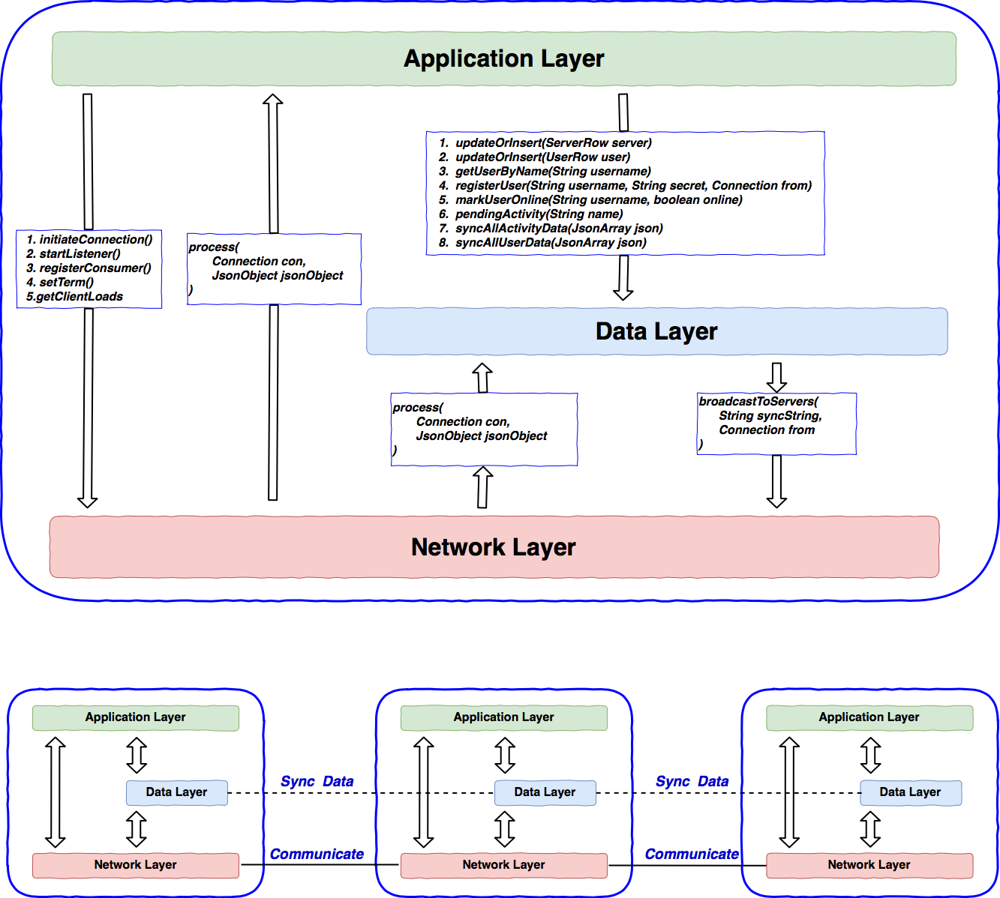
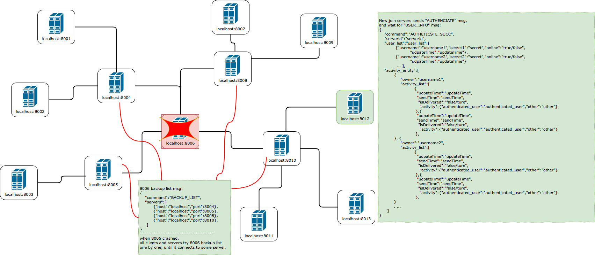

# Project 2 (improvement version of project 1)

## Project instruction

This is an improvement for DS project 1, the instruction of project 1 can be find [here](../Readme.md).

#### How to set up development environment

If you already clone any other branch from this git, just run:

```bash
git checkout layered
```

If this is your first time to clone this respository:

```bash
git clone https://kangnwh.visualstudio.com/DistributedSystem/_git/DistributedSystem
git checkout layered
```

#### How to start this system

Check [here](../src/test/readme_shortcut_lanuch.md) for detail.


## Improvement instruction

In this project, two parts (High Available & Eventually Consistency) of privious are improved by a three-layer deisgn:




#### Network layer - High Available

This is the communication layer for the whole system and is responsible for maintaining connections, sending/receiving data and delivering different types of message to different data consumer. 

The reconnection will be conducted in this layer and will not impact the other layers.



#### Data Layer - Eventually Consistency

Data layer is used to store all local data and sync its data with other servers' data layer, which means there is a **distributed database** accross the whole server system. The main idea to store is something like database **Table**. There are 3 tables designed in this projcet:

| Table           | Row           | Description                                                  |
| --------------- | ------------- | ------------------------------------------------------------ |
| `ServerTable`   | `ServerRow`   | Server information like server id, serveice host/port, load and an online flag. |
| `UserTable`     | `UserRow`     | User information like username, secret and an online flag.   |
| `ActivityTable` | `ActivityRow` | Each row represents a real user with all activities that user should receive. Once an activity is sent to the user successfully, the activity will be marked as `isDelivered`. |

The data layer exists in all servers. In order to ensure data eventually consistency, changes happen in one server should be synced by all other servers. Two ways are applide to achieve this target:

- All kinds of data will have an extral field `updateTime`, which indicates the time when it is updated. This is used for data sync.


- Transcations happen in one server will be synced to all other servers. As some communication may be lost and servers may join and leave, this design cannot ensure all data is synced among whole servers.
- Periodical sync messages will be broadcasted from every server. All servers received this kind of message from others will update its local data accordingly (only when `local.updateTime < remote.updateTime`.


## Message Handler by Different Layers

#### Application Layer

This layer conducts normal functionalities of this application.

| Message                     | Description                               | Action                                                       |
| --------------------------- | ----------------------------------------- | ------------------------------------------------------------ |
| `ACTIVITY_MESSAGE`          | Activity message from Clients             | Add new activity into data layer.<br />``` DataLayer.getInstance().insertActivity(activity,connection);``` |
| `AUTHENTICATE(update)`      | Authen message from new server            | Check secret and response accordingly.                       |
| `AUTHENTICATION_FAIL`       | Failed auth result from connecting server | close connection and exit.                                   |
| `AUTHENTICATION_SUCC(new)`  | Succ auth result from connecting server   | Begin to provide service                                     |
| `LOGIN`                     | Login message from clients                | Query user info from data layer and response accordingly<br />```DataLayer.getInstance().getUserByName(username);```<br />```DataLayer.getInstance().markUserOnline(username, true);``` |
| `LOGOUT`                    | Logout message from clients               | Mark user as "logout" in data layer.<br />```DataLayer.getInstance().markUserOnline(username,false);``` |
| `REGISTER`                  | Register message from clients             | Register user in data layer and response accordingly.<br />```DataLayer.getInstance().registerUser(username,secret,connection);```<br />1. If user exists, reply REGISTER_FAILED<br />2. else, run register process same as project 1 in data layer |
| `USER_REGISTER_RESULT(new)` | Result fom data layer                     | When register process finishes, data layer will send this message to application layer. Application Layer reply to that particular client with this register result. |


#### DataLayer

This layer is in charge of **creating/updating/deleting** data and **sync data** with other servers' data layer.

| Message                          | Description                                                  | Action                                                       |
| -------------------------------- | ------------------------------------------------------------ | ------------------------------------------------------------ |
| `LOCK_REQUEST`                   | Lock every server for a partifular username                  | When `registerUser()` is called and user does not in data layer, data layer will boradcast this message to all servers to lock register process for this particular username |
| `LOCK_ALLOWED`                   | A server successes to lock a username                        | When a server successfully locks a given username for register process, reply this message. |
| `LOCK_DENIED`                    | A server fails to lock a username                            | When a server fails to lock a given username for register process(already exists in its register process), reply this message. |
| `BroadcastResult(not a message)` | When all lock replies are received, use this for final result. | Check whether all replies are LockAllowed or at least one LockDenied:<br />\|- if all allowed: reply lockallowed(If lockrequest from server) or delegate `RegisterSucc` to application layer(if register request from clients)<br /> |
| `ACTIVITY_BROADCAST`             | New activity from other servers                              | Add activity into its own data layer and broadcast to other servers(excpet the sending one) |
| `SERVER_ANNOUNCE(update)`        | Server status from other servers                             | Update server status in its own data layer                   |
| `USER_SYNC(new)`                 | All user info to sync                                        | Compare all users' info with local data layer and update accrodingly<br />**compare `updateTime` first and decide whether need updating** |
| `USER_UPDATE(new)`               | A particular user info                                       | Compare a particular user info with local data layer and create/update accordingly.<br />**compare `updateTime` first and decide whether need updating** |
| `ACTIVITY_SYNC(new)`             | Activity lists for all registered users to sync              | Compare with local data layer and create/update accordingly.<br />**compare `updateTime` of activity first and decide whether need updating** |
| `ACTIVITY_UPDATE(new)`           | A particular user's activity list                            | Compare with local data layer and create/update accordingly.<br />**compare `updateTime` of activity first and decide whether need updating** |

#### Network Layer

This laye is responsible for maintaining connections, sending/receiving data and delivering different types of message to different data consumer.

| Message            | Description                   | Action                                                       |
| ------------------ | ----------------------------- | ------------------------------------------------------------ |
| `BACKUP_LIST(new)` | A server's backup information | Update related connection's backup info, which is used when that connection is brokn. |
| `INVALID_MESSAGE`  | In validate message           | If a message without `command` or no consumer can handle the `command` of this message, reply `INVALID_MESSAGE`. |
|                    |                               |                                                              |


#### New/Updated protocols

- SERVER_ANNOUNCE

```json
{
    "command":"SERVER_ANNOUNCE",
    "action":"update/delete",
    "serverId":"serverId",
    "load":"load",
    "ip":"ip",
    "port":"port"
}
```


- USER_UPDATE

```json
{
    "command":"USER_UPDATE",
    "username":"username",
    "secret":"secret",
    "online":"true/false",
    "udpateTime":"updateTime"
}
```

- USER_SYNC

```json
{
    "command":"USER_SYNC",
    "user_list":[
        {"username":"username","secret":"secret","online":"true/false",
         	"udpateTime":"updateTime"},
        {"username":"username","secret":"secret","online":"true/false",					 			"udpateTime":"updateTime"}
        ...
    ]
}
```

- ACTIVITY_UPDATE (activit id = activity.hashcode())

```json
{
    "command":"ACTIVITY_UPDATE",
    "owner":"username",
    "activity_list":
        {
         "udpateTime":"updateTime",
         "sendTime":"sendTime",
         "isDelivered":"false/ture",
         "activity":{"authenticated_user":"authenticated_user","other":"other"}
        }
}
```

- ACTIVITY_SYNC

```json
{
    "command":"ACTIVITY_SYNC",
    "activity_entity":[
        {USER1_ACTIVITY_UPDATE_JSON},
        {USER2_ACTIVITY_UPDATE_JSON},
        ...
	]
}
```

- AUTHENTICATE

```json
{
    "command":"AUTHENTICATE",
    "serverid":"serverid",
    "secret":"system_secret",
    "host":"ip to provide services(set from command line arg)",
    "port":"port to provide services(set from command line arg)"
}
```

- AUTHETICSTE_SUCC

```json
{
    "command":"AUTHETICSTE_SUCC",
    "serverid":"serverid",
    “server_list":SERVER_SYNC_JSON
    "user_list":USER_SYNC_JSON,
    "activity_entity":ACTIVITY_SYNC_JSON
}
```

- BACKUP_LIST
```json
{
    "command":"BACKUP_LIST",
    "servers":[
        {"host":"host_ip","port":"prot_num"},
        {"host":"host_ip2","port":"port_num2"}
    ]
}
```