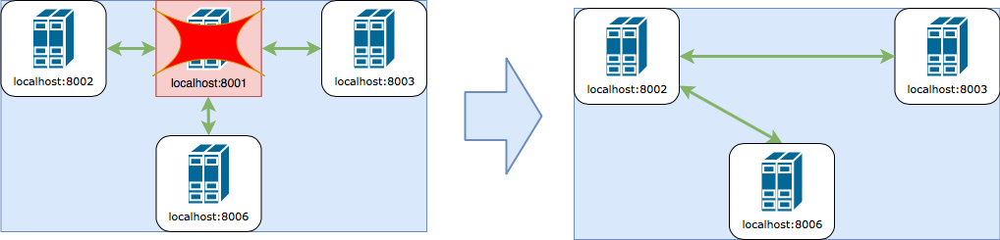
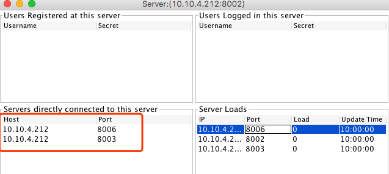

# Project 2 - Improved Multi-server Network

[TOC]


## Introduction

This is an advanced version of project 1 which provides:

- High Available
- Eventually Consistancy'


**!!! NOTE: Our implementation for delivering activity to client is synchronous, so that you may need to wait a period of time before you can actually receive an activity (default period is 1 second) !!!**

## How to start this system

### Jar file usage:

#### Server startup

```bash
usage: ActivityStreamer.Server [-a <arg>] [-activity_check_interval <arg>]
       [-lh <arg>] [-lp <arg>] [-rh <arg>] [-rp <arg>] [-s <arg>]
       [-sync_interval <arg>] [-time_before_reconnect <arg>]
An ActivityStream Server for Unimelb COMP90015

 -a <arg>                         announce interval in milliseconds

 -lh <arg>                        local hostname
 -lp <arg>                        local port number
 -rh <arg>                        remote hostname
 -rp <arg>                        remote port number
 -s <arg>                         secret for the server to use
 -sync_interval <arg>             Provide the interval (in milliseconds,
                                  5000 by default) to sync data amoung
                                  servers.
 -time_before_reconnect <arg>     Provide the time (in milliseconds, 0 by
                                  default) to wait before reconnect if a
                                  server crashes, mainly for testing
                                  eventually consistancy
 -activity_check_interval <arg>   Provide the interval (in milliseconds,
                                  1000 by default) to check whether there
                                  is new activity coming in.
```

#### Client startup

```bash
usage: ActivityStreamer.Client [-rh <arg>] [-rp <arg>] [-s
       <arg>] [-u <arg>]
An ActivityStream Client for Unimelb COMP90015
 -rh <arg>   remote hostname
 -rp <arg>   remote port number
 -s  <arg>   secret for username, if not provided, run "register" process
 -u  <arg>   username, if not provided, login as "anonymous".
```

## Test cases 

#### High Available

##### Operations

1. Start 4 servers

```bash
java -jar ActivityStreamerServer.jar -lh localhost -lp 8001 -s abc
java -jar ActivityStreamerServer.jar -lh localhost -lp 8002 -s abc -rh localhost -rp 8001
java -jar ActivityStreamerServer.jar -lh localhost -lp 8003 -s abc -rh localhost -rp 8001
java -jar ActivityStreamerServer.jar -lh localhost -lp 8006 -s abc -rh localhost -rp 8001
```

2. Force quit server 8001

Click ***Close*** icon in *<u>server UI</u>* or press ***CTRL+C*** in *<u>command line</u>*

##### Expected Result

After that you will see server 8002, 8003, 8006 will automatically connected. The picture shows a successful situation (the one, 8002, that takes 8001's place may vary).





#### Message ensure

##### Operations

In order to simulate message loss case, let us start servers with a parameter to ***delay*** the reconnection function.

1. Start 4 servers with `time_before_reconnect=10000 (10 seconds)` 

```bash
# start the very first server, which will be terminated
java -jar ActivityStreamerServer.jar -lh localhost -lp 8001 -s abc 
# start other servers  
java -jar ActivityStreamerServer.jar -lh localhost -lp 8002 -s abc -rh localhost -rp 8001 -time_before_reconnect 10000
java -jar ActivityStreamerServer.jar -lh localhost -lp 8003 -s abc -rh localhost -rp 8001 -time_before_reconnect 10000
java -jar ActivityStreamerServer.jar -lh localhost -lp 8006 -s abc -rh localhost -rp 8001 -time_before_reconnect 10000
```

2. Connect 3 clients to 3 different servers

***Note: Please record the secret of user1 for future use***

```bash
# !!!! register user1 and record its secret for furture use !!!!
java -jar ActivityStreamerClient.jar -u user1 -rp 8001 -rh localhost
# you can just run below 2 clients and no need to record their secretrs
java -jar ActivityStreamerClient.jar -u user2 -rp 8002 -rh localhost
java -jar ActivityStreamerClient.jar -u user3 -rp 8003 -rh localhost
```


1. Terminate server 8001 and send a message from user2 within 10 seconds

- Click ***Close*** icon in *<u>server UI</u>* or press ***CTRL+C*** in *<u>command line</u>* (user 1 will lose connection)
- Send message `{"a":1}` from user2.
- Wait for reconnection happens (10 seconds)

4. Reconnect user1 to any working server, let's say 8006

Replace `$secret` of below script with the secret from step 2.

```bash
java -jar ActivityStreamerClient.jar -u user1 -s $secret -rp 8006 -rh localhost
```

java -jar ActivityStreamerClient.jar -u user1 -s boo02tadp6a1nfq3cc3flk1n3v -rp 8006 -rh localhost

##### Expected Result

- user3 will receive the activity of user2 after reconection is done ( about 10 seconds after disconnection)
- user1 will receive the activity of user2 after relogin to server 8006

> user A is online at the time T, when a activity is sent by some other user B and A loses its connection it can receive this message.
>
> When user A reconnects to any server of this system, it can also receive this lost message.


#### Message order

In order to simulate message disorder case, let us use a ***telnet session*** to simulate a ***server***  and make the order checking period a littler longer with `activity_check_interval=5000 `.

##### Operations

1. Start 1 server with `activity_check_interval=10000 (10 seconds)` 

```bash
java -jar ActivityStreamerServer.jar -activity_check_interval 10000 -lh localhost -lp 8001 -s abc
```

2. Start a normal client connecting to server 1

```bash
java -jar ActivityStreamerClient.jar -u user1 -rp 8001 -rh localhost
```

3. Start a terminate and using telnet to simulate a client in following steps

- start telent session

```bash
telnet localhost 8001
```

- paste below string to authenticate this "server" with server 8001

```json
{"command":"AUTHENTICATE","serverId":"serverId01","secret":"abc","host":"localhost","port":8002}
```

- Broadcast 2 "fake" activities (**!!! within 5 seconds !!!**) by pasting below 2 string **separately(one by one)** into telnet session to simulate disordered message.

*You can ignore the message telnet receive. All of them are used by real server to sync data.*

> timeBack field is a back door used for this kind of testing. If that field exists in an ActivityBroadcast message, then set the `sendTime` of this activity to `currentTimeInMillis() - timeBack`

Message 1: a "fake" message that send 1 second ago

```json
{"id":0,"activity":{"message_num":2,"authenticated_user":"user2"},"isDelivered":false,"command":"ACTIVITY_BROADCAST","timeBack":0}
```

Message 2: a "fake" message that send 5 second ago, which is early than preious one.

```json
{"id":0,"activity":{"message_num":1,"authenticated_user":"user2"},"isDelivered":false,"command":"ACTIVITY_BROADCAST","timeBack":10000}
```

##### Expected Result

- After waiting 5 seconds,  user1 (normal client with GUI) will receive 2 activities in order (message_num=1 first and then message_num=2)


#### Unique Register

##### Operations

1. start several servers, say 3

```bash
java -jar ActivityStreamerServer.jar -lh localhost -lp 8001 -s abc
java -jar ActivityStreamerServer.jar -lh localhost -lp 8002 -s abc -rh localhost -rp 8001
java -jar ActivityStreamerServer.jar -lh localhost -lp 8003 -s abc -rh localhost -rp 8001
```

2. register user1 at server 8001

```bash
java -jar ActivityStreamerClient.jar -u user1 -rp 8001 -rh localhost
```

3. try to register user1 at another server, say 8002

```bash
java -jar ActivityStreamerClient.jar -u user1 -rp 8002 -rh localhost
```

##### Expected Result

- the registration of step 3 will fail with error like "user already exists".

#### Client can join and leave any time

Just try...

#### Server can join at any time

##### Operations

1. start the very first server

```bash
java -jar ActivityStreamerServer.jar -lh localhost -lp 8001 -s abc
```

2. register a user at this server and remember its secret.

```bash
java -jar ActivityStreamerClient.jar -u user1 -rp 8001 -rh localhost
```

3. Quit client of step 2
4. start a new server connecting to server 8001

```bash
java -jar ActivityStreamerServer.jar -lh localhost -lp 8002 -s abc -rh localhost -rp 8001
```

5. Login user1 at the new server (8002) by replace `$secret` of below script

```bash
java -jar ActivityStreamerClient.jar -u user1 -s $secret -rp 8002 -rh localhost
```

##### Expected Result

- user1 should login successfully at new server (8002) and all data of 8002 should be synced with 8001

- From test case [Message ensure](#Message ensure) we can also see that: 

  > user A is online at the time T, when a activity is sent by some other user B and A loses its connection it can receive this message.
  >
  > When user A reconnects to any server of this system, it can also receive this lost message.

#### Load balancing

##### Operations

1. start 2 servers 

```bash
java -jar ActivityStreamerServer.jar -lh localhost -lp 8001 -s abc
java -jar ActivityStreamerServer.jar -lh localhost -lp 8002 -s abc -rh localhost -rp 8001
```

2. Register and login 2 clients both to server 8001

```bash
java -jar ActivityStreamerClient.jar -u user1 -rp 8001 -rh localhost
java -jar ActivityStreamerClient.jar -u user2 -rp 8001 -rh localhost
```

##### Expected Result

- user2 will be redirected to server 8002


## Contributors

Ning Kang

Nannan Gu

Yiru Pan

Wenyi Zhao


## Copyright

This is a solution of Distributed System of University of Melbourne(2018).

Refer to the idea of this project is ok but **DO NOT COPY**.